# 📌 Features.md

## 🧩Main Features of the Product

### 1. 🔐 User Authentication
- Register a new account (using email and password).
- Log into the system.
- Log out of the system.

📸 *Illustration::*  
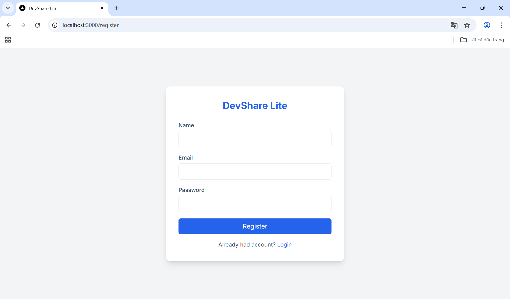
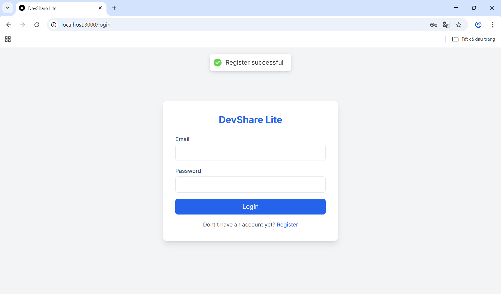

---

### 2. 📝 Post Management (Posts)
- Logged-in users can:
  - Create a new post with title, content (basic Markdown), and tags.
  - Save posts as Draft or publish them publicly (Publish).
  - View the list of posts (with pagination).
  - View post details.
  - Edit or delete their own posts.

📸 *Illustration*  
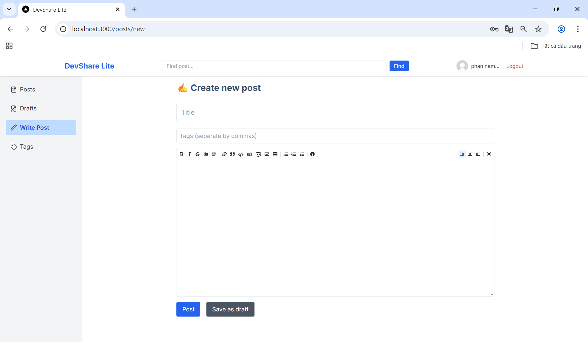
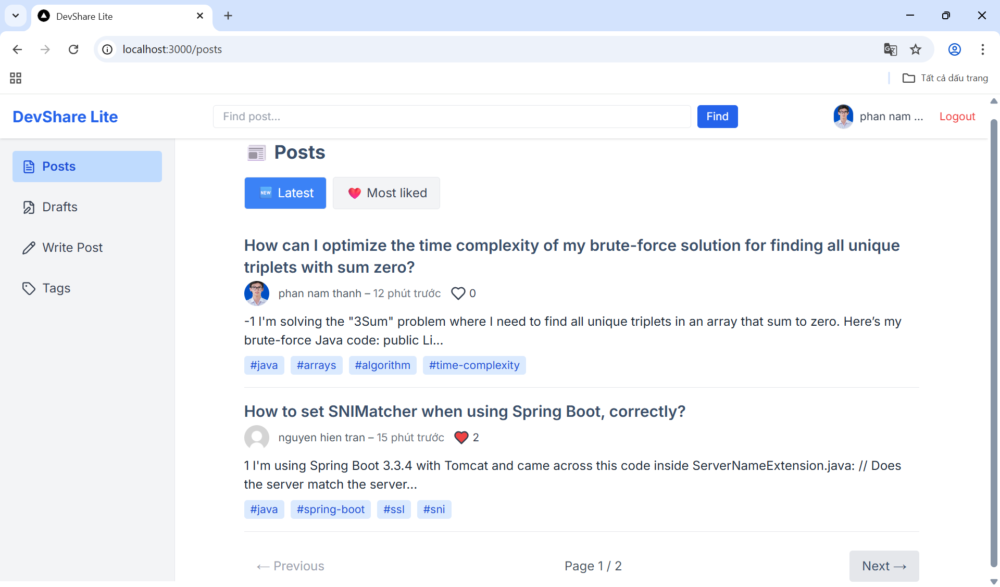
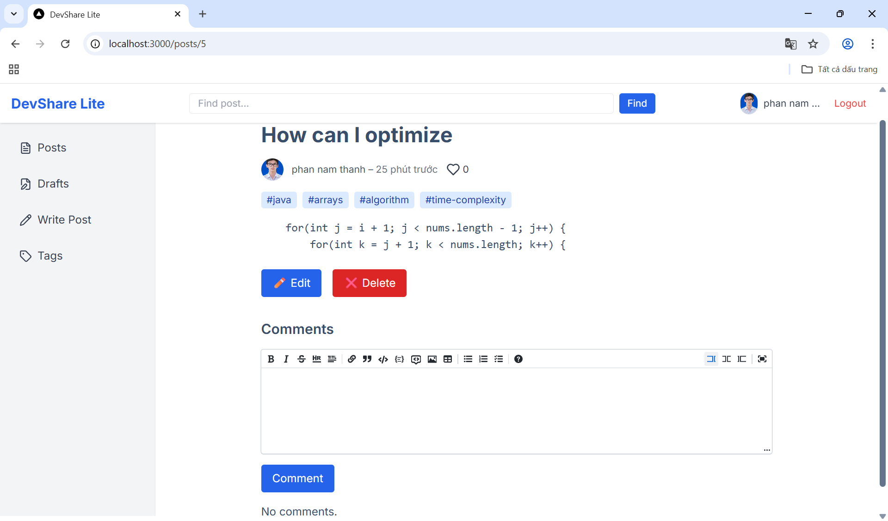
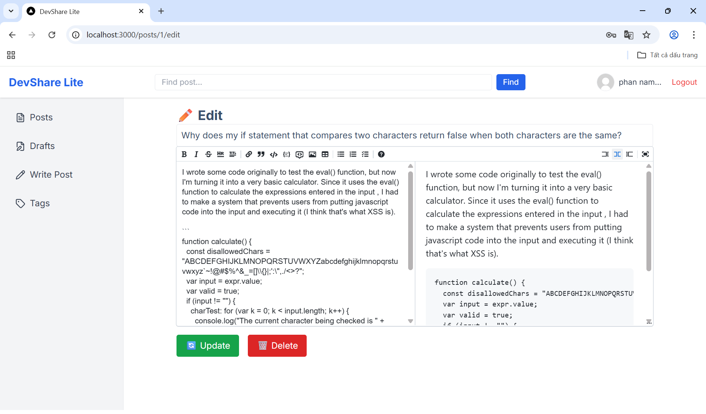
---

### 3. 💬 Comments
- Logged-in users can:
  - Comment under each post.
  - Reply to other comments (nested comments supported).

📸 *Illustration:*  
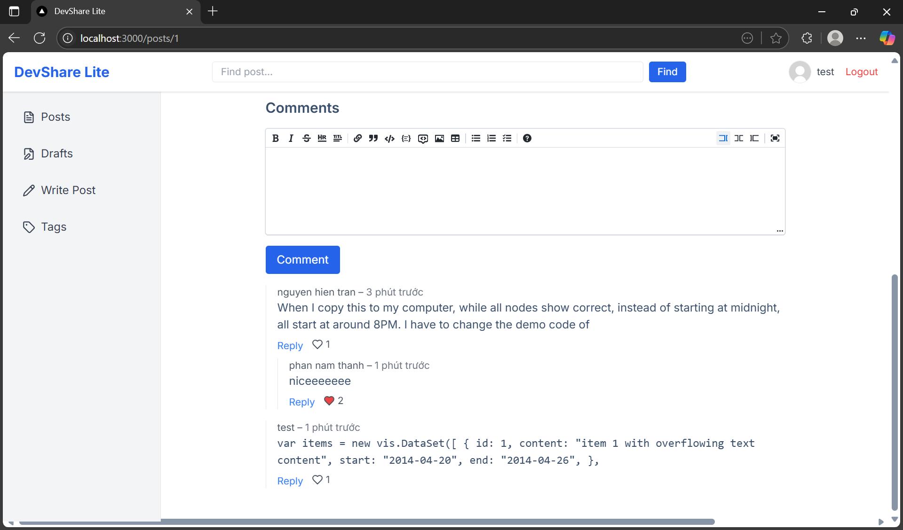
---

### 4. 🔎 Basic Search
- Search posts or questions by **title** or **content**.

📸 *Illustration:*  
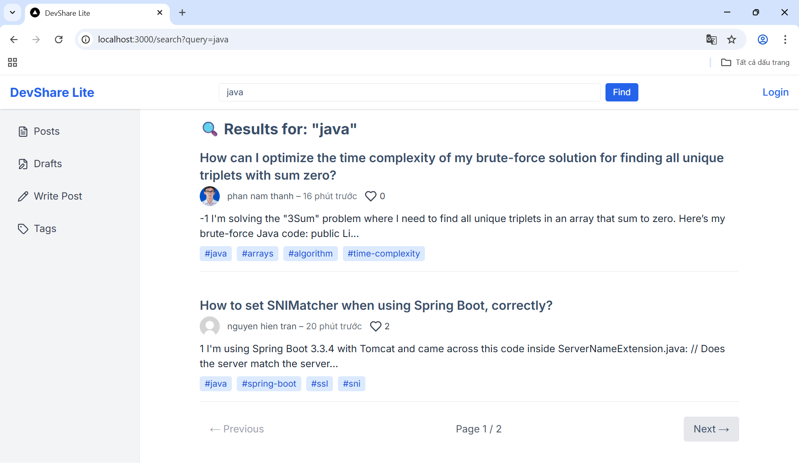

---

### 5. 🙍‍♂️ User Profile Page
- Display basic information (name, email).
- List of published posts.
- List of posts in Draft status.

📸 *Illustration:*  

---

## ✨ Advanced Features Implemented (beyond minimum requirements)

- Integrated OpenAI Moderation for content filtering.

- Filter posts by latest and most liked.

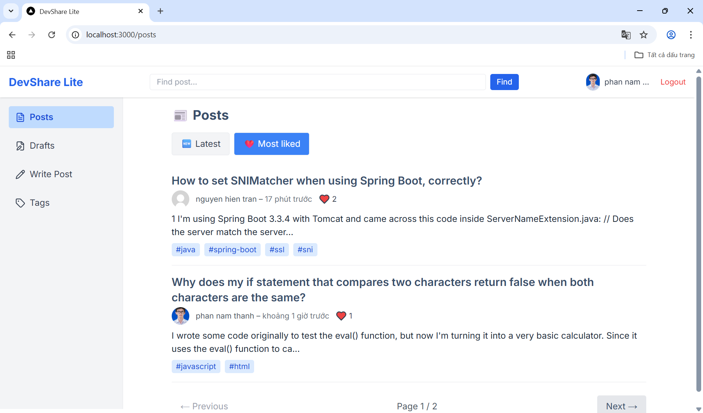
- Like feature for posts and comments.

- Tag-based filtering.
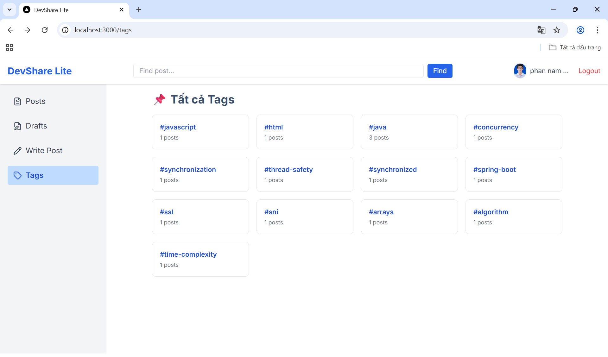
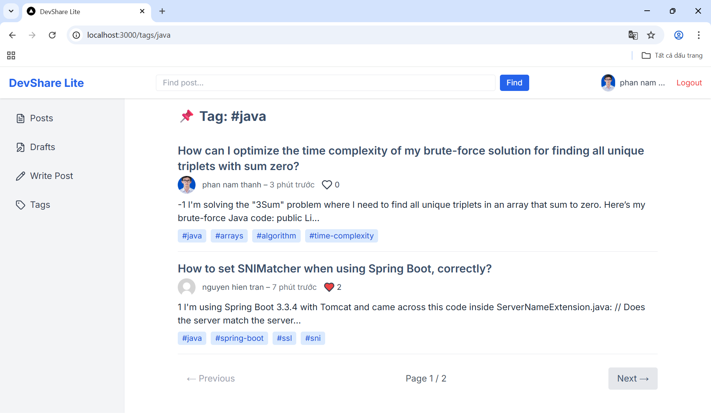
- Friendly error display using Toast (Frontend UX).
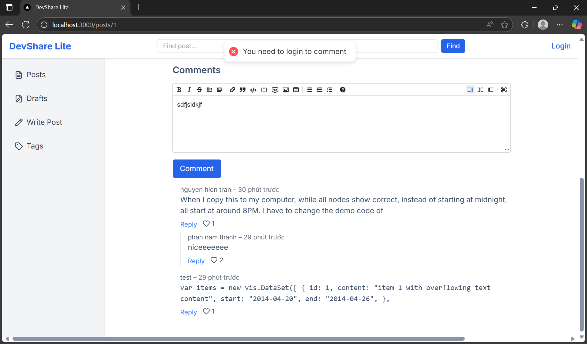
- Avatar update feature.
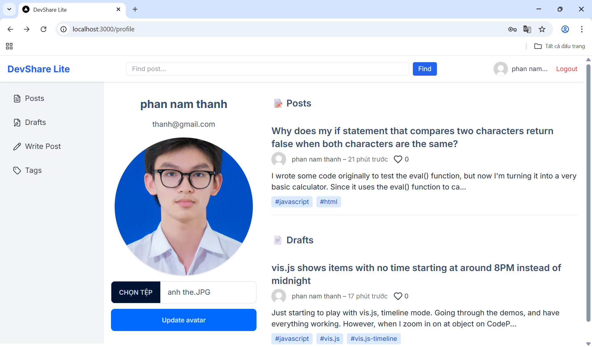
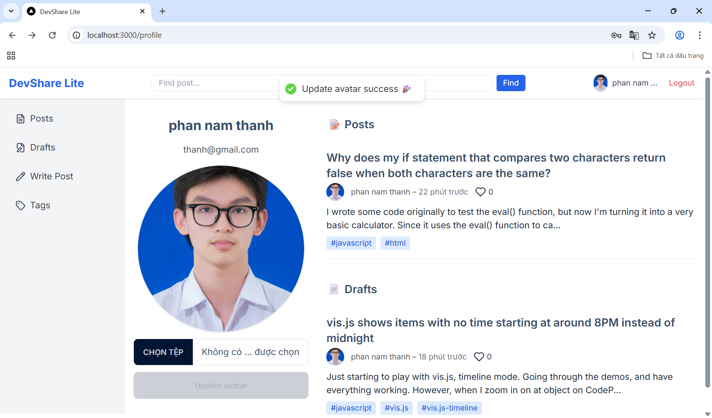

---

## 🧩 Issues Faced and Solutions

| Issue | Solution |
|--------|-----------|
| JWT not automatically attached in requests | Added Axios interceptor to automatically include Authorization header |
| Need long-term login without reducing security | Used Access Token + Refresh Token|
|User accessing protected routes without logging in | Used Next.js middleware to check login status and auto-redirect to login page |
| Display nested replies in comments | Used recursion to render child comments |

---

## 🛑 Known Limitations

- No admin role/authorization yet.
- No notification system.
- No user follow feature.
- Mobile UI still very basic.

---

## 🚀 Future Directions

- Add user roles (admin).
- Notification system for interactions (comments, likes, replies...).
- Analytics dashboard for posts and user activity.
- AI integration:
  - Suggest titles and tags for posts.
  - Analyze content quality and assist in better writing.
